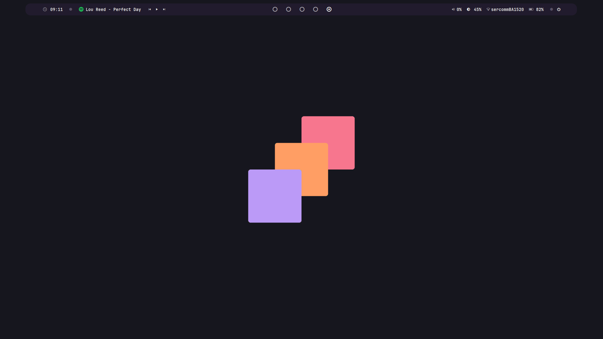
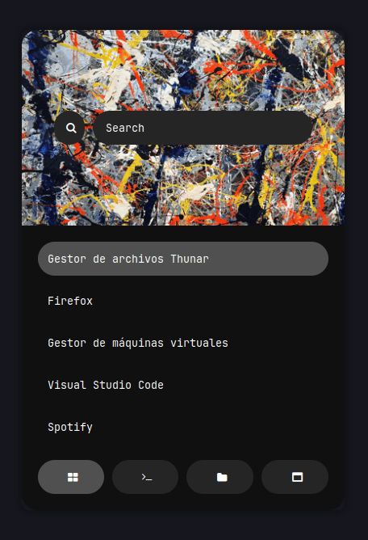
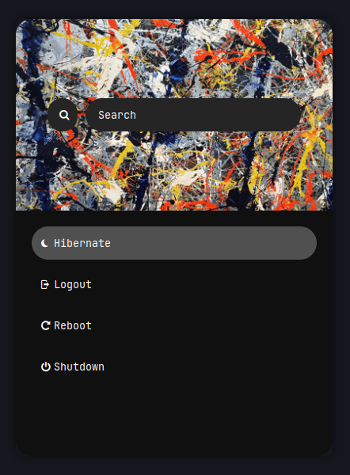
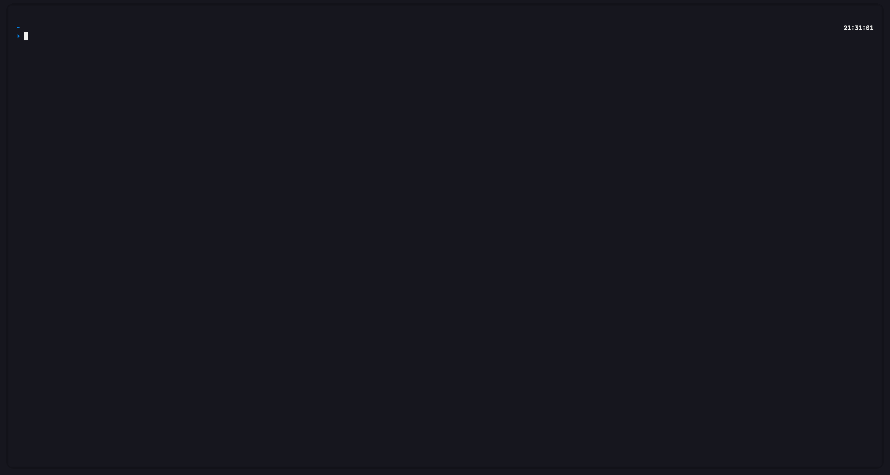

<a href="#--------"></a>

# dotfiles
A simple Arch linux config, with usability and productivity in mind at the making of this config. Without ignoring the looks of it. A no-nonsense, fully-practical, built-for-working, focus-centered build for arch.

This way of personalizing my system uses i3 as its main window manager, and the top bar is powered with polybar. The terminal emulator is kitty, and has 4 custom scripts that are located at `https://github.com/porbee/dotfiles/tree/main/.dotfiles/bin`.

The reason for this is to keep my dotfiles in a safe and easily downloadable repository. Mainly for not having to keep my dotfiles in a USB stick.

## not updated for use without USB

## [fork it](https://github.com/porbee/dotfiles/fork)

This is completely free, do not fear experimenting with the configs that i use, you can always adapt some of my configs to be the ones that you may want. Please be curious and try some for yourself. Good artists copy; great artists steal.

Here are some details about my setup:

- **OS:** [Arch Linux](https://archlinux.org)
- **WM:** [i3](https://github.com/i3/i3)
- **Terminal:** [kitty](https://github.com/kovidgoyal/kitty)
- **Shell:** [zsh](https://www.zsh.org/)
- **Editor:** [neovim](https://github.com/neovim/neovim) / [vscode](https://github.com/microsoft/vscode)
- **Compositor:** [picom](https://github.com/yshui/picom)
- **Application Launcher:** [rofi](https://github.com/davatorium/rofi)
- **Music Player** [moc](https://github.com/jonsafari/mocp)

## shortcuts

> [!TIP]
> The zsh [aliases](https://github.com/porbee/dotfiles/blob/main/.dotfiles/zsh/config/aliases.zsh) are located inside the zsh config directories. Feel free to change and adapt them to your workflow.

| Command     | Description                    |
| ----------- | ------------------------------ |
| `⊞-h`       | Select the pane to the left    |
| `⊞-j`       | Select the pane to the bottom  |
| `⊞-k`       | Select the pane to the top     |
| `⊞-l`       | Select the pane to the right   |
| `⊞-ENTER`   | Start a terminal               |
| `⊞-Q`       | Kill focused window            |
| `⊞-D`       | Start the app laucher          |
| `⊞-n`       | Change to workspace n          |

> [!NOTE]
> For more info on the keyboard shortcuts, go to the (config)[https://github.com/porbee/dotfiles/blob/main/.dotfiles/i3/config] file inside i3

## colorscheme

Custom made and engineered. Smooth color pallet with vibrant colors, dark themed and soothing. Genuine eye candy. 
Color palette based in many other known palettes, mainly nord for its simplicity and practicality.

<details>
<summary>Xresources</summary>
<br>

```cfg
! special
*.foreground:   #EEEEEC
*.background:   #16161E

! black
*.color0:       #232323
*.color8:       #444444

! red
*.color1:       #FF000F
*.color9:       #FF2740

! green
*.color2:       #8CE10B
*.color10:      #ABE15B

! yellow
*.color3:       #FFB900
*.color11:      #FFD242

! blue
*.color4:       #008DF8
*.color12:      #0092FF

! magenta
*.color5:       #6D43A6
*.color13:      #9A5FEB

! cyan
*.color6:       #00D8EB
*.color14:      #67FFF0

! white
*color7:        #FFFFFF
*color15:       #FFFFFF
```

</details>

<details>
<summary>Base16</summary>
<br>

```lua
base_16 = {
	base00 = "#232323",
	base01 = "#444444",
	base02 = "#FF000F",
	base03 = "#FF2740",
	base04 = "#8CE10B",
	base05 = "#ABE15B",
	base06 = "#FFB900",
	base07 = "#FFD242",
	base08 = "#008DF8",
	base09 = "#0092FF",
	base0A = "#6D43A6",
	base0B = "#9A5FEB",
	base0C = "#00D8EB",
	base0D = "#67FFF0",
	base0E = "#FFFFFF",
	base0F = "#FFFFFF",
}
```

</details>

## gallery

| <b>Modern Top Panel</b>                                                                                  |
| -------------------------------------------------------------------------------------------------------- |
| <a href="#--------"></a>          |

| <b>Aesthetic App Launcher</b>                                                                            |
| -------------------------------------------------------------------------------------------------------- |
| <a href="#--------"></a> |

| <b>Minimalist Exitscreen</b>                                                                             |
| -------------------------------------------------------------------------------------------------------- |
| <a href="#--------"></a> |

| <b>Terminal</b>                                                                                          |
| -------------------------------------------------------------------------------------------------------- |
| <a href="#--------"></a>      |

## install

> [!WARNING]
> In order to proceed, you will need to execute some scripts that require superuser rights. I recommend you read the scripts to know what changes might be happening in your machine.
>
> If you have not backed up your config files, now its time. **Proceed at your own risk**.

You can clone the repository wherever you want. The bootstrapper script will pull in the latest version and copy the files to your home folder.

```bash
git clone https://github.com/porbee/dotfiles.git && cd dotfiles/INSTALLER && source bootstrap.sh
```

Then follow the indications that the `bootstrap` script gives you, selecting the options that you want and suites you more. 

## uninstall

In order to uninstall, you had to execute `bootstrap.sh`. Then you have to enter the `INSTALLER/configs_uninstall` directory and execute [dotclean.sh](https://github.com/porbee/dotfiles/blob/main/INSTALLER/configs_uninstall/dotclean.sh), and proceed following the steps of the uninstallation.

## level

> [!NOTE]
> This feature is unfinished and needs to be polished, more info on the level executables inside the [directory](https://github.com/porbee/dotfiles/tree/main/INSTALLER/packs/level)

The level refers to `dotfiles/INSTALLER/packs/level`. The level mechanic is unfinished, and it was made for the installation to be compartimentalized. It is divided in five parts, and the user could specify how many layers (or levels) of the installation wants installed. Level one being the most basic and level five being the complete installation.

## license

This config is under <a href="https://github.com/porbee/dotfiles/blob/main/LICENSE">GNU GPL-3.0 License.
</a>
